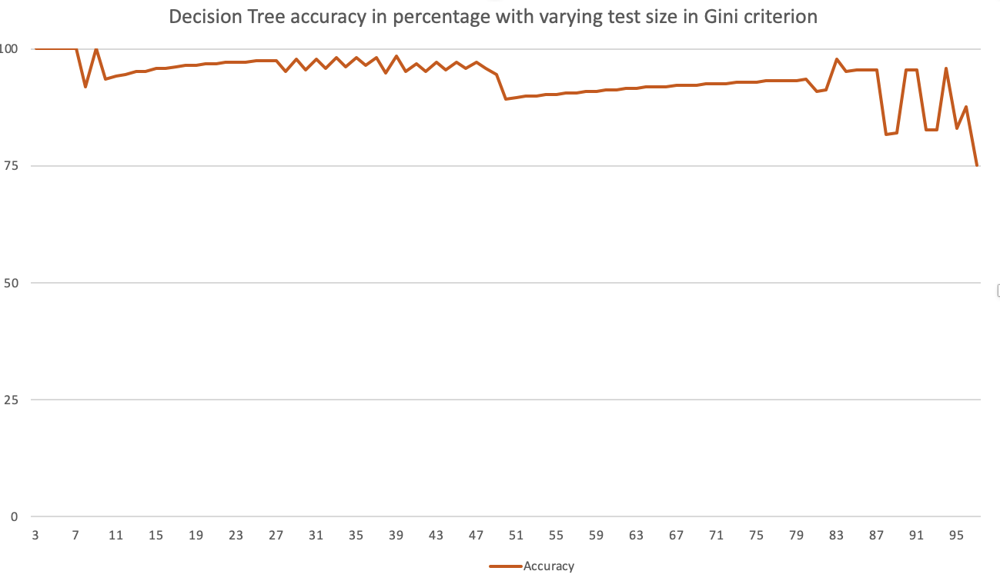

# Iris.
An implementation of classification algorithms on Iris data set. The Iris data set can be downloaded from [here.](https://archive.ics.uci.edu/ml/datasets/iris) The implementation focuses on predicting and analysing the data using classification algorithms. Accuracy of prediction is observed under different ratio of training and test data for the algorithms.

### Algorithms used:
1. K nearest neighbours
2. Decision Tree

### Accuracy vs Train-Test split:

### Decision Tree
 

### K nearest neighbours

